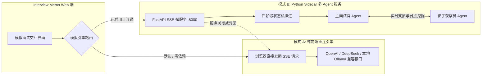

# 💼 Interview Memo

<div align="center">

**本地优先的现代求职面试全流程管理工作台**

精细化跟踪求职进展 · 沉淀高频真题题库 · 艾宾浩斯间隔复习 · 双引擎多轮模拟面试 · 摸鱼防偷窥模式

[](https://react.dev/)
[](https://www.typescriptlang.org/)
[](https://vitejs.dev/)
[](https://tailwindcss.com/)
[](https://github.com/pmndrs/zustand)
[](https://vitest.dev/)
[](services/mock-agent-service)
[]()
[](LICENSE)

[功能特性](#-核心功能亮点) • [快速开始](#-快速开始) • [双引擎模拟](#-双引擎模拟面试架构) • [工作流闭环](#-求职全流程闭环) • [快捷键](#%EF%B8%8F-快捷键速查) • [技术栈](#%EF%B8%8F-技术栈清单)

</div>

---

## 🌟 为什么选择 Interview Memo？

在竞争激烈的求职季，候选人往往需要投递数十甚至上百家公司。然而通用的笔记软件或电子表格存在诸多痛点：

- ❌ **投递版本混乱**：针对不同技术方向准备了多套简历，投递后经常记不清哪家公司投了哪个版本、附带了哪些具体项目。
- ❌ **面试考完就忘**：被面试官问倒的技术细节、弱项短板分散记录，无法形成题目去重、沉淀与系统性复盘。
- ❌ **复习缺乏科学性**：凭感觉翻看面经，缺乏记忆遗忘曲线管理，临场再次栽在同类考点上。
- ❌ **面试练习无实感**：普通通用大模型缺乏大厂面试官的连环追问能力，常常单轮自由发散，无法还原真实压力面试。
- ❌ **隐私泄露风险**：将个人的薪资期望、求职动向与完整履历上传到第三方在线协作平台，存在隐私数据外泄隐患。

**Interview Memo** 专为解决上述痛点而生：
- 🔒 **纯本地优先 (Local-First)**：数据 100% 保存在浏览器本地，无后端、无需登录、零隐私上报，导出备份自动脱敏 API Key。
- 🔁 **闭环进化体系**：建立从「投递 → 轮次追踪 → 问答沉淀 → 深度复盘 → 艾宾浩斯复习 → 数据洞察 → 模拟面试压测」的完整飞轮。
- 🤖 **双引擎拟真模拟**：零配置的纯前端直连流式引擎 + 具备阶段状态机与影子观察员的 Python Sidecar 微服务。
- 🛡️ **独创摸鱼防偷窥模式**：快捷键 `Alt + P` 瞬间将全站求职敏感词替换脱敏，网页标签伪装为 `Dev Memo`，办公室求职无压力。

---

## 🔄 求职全流程闭环

数据在 Interview Memo 中不是孤立的卡片，而是环环相扣、自然流动的求职飞轮：

```mermaid
flowchart TD
    subgraph 准备与投递
        A[共享项目库 / 多套简历] -->|派生并冻结不可变版本| B[简历不可变版本 v1/v2]
        C[目标公司档案] --> D[岗位需求 & JD]
        B -->|绑定投递版本| D
    end

    subgraph 流程推进与实战
        D -->|看板拖拽流转| E[轮次面试一面/二面/HR面]
        E -->|实战问答记录| F[题目 / 我的回答 / 评分]
        E -->|多维打分与自动摘要| G[深度复盘总结]
    end

    subgraph 知识沉淀与强化
        F -->|语义去重 & 智能合并| H[(个人知识库 / 题库)]
        H -->|3天 / 7天 / 21天 动态调度| I[艾宾浩斯间隔复习队列]
        F & G --> J[数据洞察 & 弱项分析]
        J -->|学习优先级加权算法| K[攻坚知识点清单]
        K -->|一键下发| E
    end

    subgraph 战前压测
        D & B & H --> L[AI 模拟面试: 岗位全真 / 项目深挖]
        L -->|结构化评估报告| M[优缺点分析 & 建议新题]
        M -->|一键沉淀| H
    end
```

---

## 🤖 双引擎模拟面试架构

为了兼顾「开箱即用、免安装」与「大厂深度压力面试」的双重需求，系统设计了优雅降级的双引擎架构：



### 两种引擎对比

| 维度 | 内置引擎（默认） | 外部 Python Sidecar 服务（可选） |
| :--- | :--- | :--- |
| **部署门槛** | ⭐️ 零依赖，只要有浏览器即可使用 | 需本地运行 Python 3.10+ 微服务（见 `services/mock-agent-service`） |
| **通信机制** | 前端直连任意兼容 OpenAI 的 LLM API | 标准 HTTP Server-Sent Events (SSE) 高性能流式通信 |
| **面试推演** | 基于高质量 Prompt 的单轮推进与流式响应 | **阶段状态机推演**：`开场破冰` → `STAR 项目拆解` → `底层与高并发压测` → `反问` |
| **决策机制** | 基础上下文对话 | **双 Agent 协作**：影子观察员后台剖析技术漏洞，动态给主面试官输出追问建议 |
| **容灾降级** | 基础兜底模式 | **无缝优雅降级**：检测到 Sidecar 断开或未开启时，前端自动切换回内置引擎 |

---

## ✨ 核心功能亮点

### 1. 🛡️ 摸鱼与防偷窥模式 (Privacy Mode, `Alt + P`)
- **办公室与公共场合防社死**：一键切换后，全站所有敏感求职词汇将实时通过底层 DOM 节点脱敏替换为代号。
  - `面试` → `MS`，`求职` → `QZ`，`简历` → `JL`，`岗位` → `GW`，`投递` → `TD`，`薪资` → `XZ`，`Offer` → `OF`，`笔试` → `BS`，`一面/二面` → `1M/2M`...
- **标签页伪装**：浏览器 Title 自动隐蔽为 `Dev Memo`，彻底避免同事路过或投屏演示时的尴尬。
- **无损切换**：再次按下快捷键，界面无损瞬时恢复原始文本，不影响底层真实数据的存储。

### 2. 📋 岗位全生命周期看板 (Kanban & Table 双视图)
- **多阶段流转**：已投递 → 笔试 → 一面 → 二面 → HR面 → 已获Offer → 接受Offer → 已结束。
- **拖拽与批量管理**：基于 `@dnd-kit` 实现平滑拖拽，同时提供强大的表格视图支持多维筛选与统计。
- **关闭原因追踪**：岗位关闭时支持记录原因（面试失败、笔试失败、拒绝 Offer、主动放弃），并记录关闭前阶段，保障漏斗转化率计算的客观准确。
- **简历投递绑定**：每个岗位均可关联具体投递的简历版本，并在该岗位后续的所有面试中直观透传。

### 3. 📄 多简历管理与不可变版本控制 (Resume Versioning)
- **多技术侧重支持**：独立维护多套简历（如算法版、全栈版、海外英文版）。
- **不可变版本派生**：通过「基于此版本新建」生成 `v1`, `v2`, `v3` 等不可变版本，被岗位或模拟会话引用的版本仅可归档不可物理删除，杜绝历史投递记录失真。
- **共享项目池与快照冻结**：统一维护核心项目库，创建简历版本时**深度冻结**当前所选项目的内容快照。即使后期在共享库中修改了项目细节，历史投递版本的快照永不漂移。
- **本地多格式解析器**：内置 PDF.js 与 Mammoth 引擎，本地零依赖解析 PDF、Word (`.docx`)、Markdown、TXT、HTML、RTF，自动提取教育背景、技能特长与个人简介，并可选大模型智能识别项目经历。

### 4. 🎙️ 轮次面试记录与结构化深度复盘
- **全轮次维度覆盖**：一面、二面、三面、HR面、加面、笔试；涵盖视频、电话、现场多模式。
- **逐题深度复盘工作台**：录入面试真题、我的回答、面试官反馈、理想参考答案，并支持一键标为「弱项」。
- **四维评分与智能摘要**：整体表现、面试难度、技术匹配度、岗位匹配度多维打分；未手动修改时，系统根据评分和弱项自动提炼并生成复盘摘要。
- **行动项 Checklist**：现场记录本场暴露的学习任务清单，支持打卡核销并可无缝承接至下一场面试。

### 5. 🧠 个人题库沉淀与艾宾浩斯间隔复习
- **双重去重归档**：
  - 本地文本相似度快速初筛；
  - 可选 LLM 语义去重判定（相同知识点、不同提问形式智能识别），自动累加出现频次并沉淀别名。
- **艾宾浩斯记忆模型**：题目分为「熟练 / 一般 / 不熟」三档掌握度。列表提供「记住了 / 模糊 / 忘了」快捷打卡，分别在 21 天、7 天、3 天后自动重新推入待复习队列。
- **体系化分类**：内置大模型方向（Transformer、SFT、RL、Agent、RAG）预置分类体系，支持用户自由增删层级。

### 6. 📊 多维数据洞察与智能学习优先级算法
- **招聘阶段转化漏斗**：基于真实流转阶段科学回溯计算各环节留存与通过率。
- **弱项与高频考点矩阵**：横向对比标签考频与弱项率，一眼看穿当前准备中的“最大短板”。
- **科学学习优先级算法**：
  $$\text{Priority Score} = \text{WeakRate} \times 0.4 + (5 - \text{AvgRating}) \times 0.3 + \text{AppearPenalty}$$
  系统自动计算攻坚排行榜，并支持**一键推送 Top 知识点至下一场面试的学习清单**。
- **AI 智能备考建议**：调用大模型基于全量薄弱项生成针对性冲刺学习方案。

### 7. 🔍 全局指令检索面板 (`Ctrl/Cmd + K`)
- 全站任意位置随时按下 `Ctrl + K`（Mac 上为 `Cmd + K`），即刻唤出 Command Palette。
- 毫秒级全局模糊索引：公司、岗位、面试记录、题库知识点、模拟面试会话与简历，支持方向键快速直达。

### 8. ⏰ 智能预警、定时提醒与严格隐私安全
- **24小时紧急预警**：总览仪表盘动态根据当前时间展示临近面试，24 小时内即将到来的面试以高饱和警示色和动态问候语提醒。
- **多级提醒通知**：支持提前 1 天、3 小时、1 小时、15 分钟等多档位配置，支持应用内 Toast 与浏览器系统级通知。
- **严格 Zod 导入校验**：支持数据全量覆盖与按 ID 增量合并，校验不匹配时给出精准错误定位提示。
- **密钥安全脱敏**：导出 JSON 数据时全自动剔除 API Key 等隐私凭据，便于在多设备间安全同步迁移。
- **本地存储用量监控**：实时计算 `localStorage` 占用空间，支持一键清理过期的模拟对话。

---

## ⌨️ 快捷键速查

| 快捷键 | 功能说明 | 适用场景 |
| :--- | :--- | :--- |
| <kbd>Ctrl + K</kbd> / <kbd>Cmd + K</kbd> | 打开全局指令搜索面板 | 快速跨模块定位公司、岗位、面试或题库 |
| <kbd>Alt + P</kbd> | 开启 / 关闭全站摸鱼防偷窥模式 | 办公室、图书馆等公众场合快速脱敏避嫌 |
| <kbd>Esc</kbd> | 关闭当前弹窗 / 退出检索框 | 任意模态框或抽屉组件 |

---

## 🚀 快速开始

### 运行环境要求
- **前端主应用**：Node.js 18.0 或更高版本（推荐使用 pnpm / npm）
- **外部多 Agent 模拟服务（可选）**：Python 3.10 或更高版本

---

### 第一步：启动前端主应用

```bash
# 1. 克隆代码仓库
git clone https://github.com/your-username/Interview-Memo.git
cd Interview-Memo

# 2. 安装项目依赖
npm install
# 或者使用 pnpm
# pnpm install

# 3. 启动本地开发服务
npm run dev
```

在浏览器中打开终端输出的本地地址（通常为 `http://localhost:5173`）。首次进入系统会自动预置一份演示数据，方便快速上手。

#### 其他前端常用命令

```bash
npm run build     # 生产环境打包构建
npm run preview   # 预览生产构建结果
npm run lint      # 执行 Oxlint 静态代码质量检查
npm test          # 运行 Vitest 单元测试套件（9 个测试文件全绿）
```

---

### 第二步（可选）：启动外部 Python 模拟面试 Sidecar 服务

如果你希望在「模拟面试」中体验多阶段状态机推演与双 Agent 压测，可快速启动本地 Python 微服务：

```bash
# 1. 进入微服务目录
cd services/mock-agent-service

# 2. 创建并激活 Python 虚拟环境
python -m venv .venv

# Windows 激活命令：
.venv\Scripts\activate
# macOS / Linux 激活命令：
source .venv/bin/activate

# 3. 安装依赖包
pip install -r requirements.txt

# 4. （可选）配置大模型 API Key（若不配置，服务将以内置的离线状态机演示问答运行）
# 复制或创建 .env 文件，填写：
# OPENAI_API_KEY=sk-xxxxxx
# OPENAI_BASE_URL=https://api.deepseek.com/v1
# OPENAI_MODEL=deepseek-chat

# 5. 启动微服务
uvicorn main:app --reload --host 127.0.0.1 --port 8000
```

#### 在前端中启用 Sidecar：
1. 打开前端应用，进入 **「设置」(`/settings`)**；
2. 找到 **「外部模拟面试服务 (Sidecar)」** 卡片，勾选启用并确认服务地址为 `http://127.0.0.1:8000`；
3. 点击 **「测试连接」**，看到绿色「在线」标识即生效；
4. 前往「模拟面试」发起面试，顶部将显示 `⚡ 外部多 Agent 驱动` 专属徽章。

---

## 📖 页面功能地图

```
/                     总览仪表盘（KPI统计、漏斗分析、临近面试、复习清单）
├── /jobs             岗位看板与表格（拖拽改阶段、按公司/优先级筛选）
│   └── /jobs/:id     岗位详情（JD查看、投递简历版本、关联面试时间线）
├── /resumes          简历与项目管理（多套简历维护、共享项目库）
│   └── /resumes/:id  简历详情（不可变版本列表、快照对比、项目冻结预览）
├── /interviews       面试列表（按时间线、公司、轮次、状态筛选）
│   └── /interviews/:id 面试工作台（问答逐题记录、弱项标记、一键归档到题库）
├── /review           复盘列表（待复盘与已复盘面试统计）
│   └── /interviews/:id/review 深度复盘（四维打分、做得好/待改进、自动生成摘要）
├── /calendar         面试日历（月/周/日视图，紧急程度标识，每周起始日切换）
├── /knowledge        个人题库（掌握度筛选、艾宾浩斯待复习队列、打卡更新）
├── /insights         数据洞察（招聘漏斗、高频考点、弱项率矩阵、学习优先级建议）
├── /companies        公司档案（行业、技术方向、评价备注、名下岗位汇总）
├── /mock             模拟面试大厅（简历解析、项目选择、模式配置）
│   └── /mock/:id     模拟面试考场（多轮流式问答、多Agent追问、结构化反馈报告）
└── /settings         系统设置（个人偏好、摸鱼模式、提醒规则、大模型配置、Sidecar、数据导入导出）
```

---

## 🛠️ 技术栈清单

### 前端架构 (Frontend)
- **核心框架**：[React 19](https://react.dev/) + [TypeScript](https://www.typescriptlang.org/) + [Vite 8](https://vitejs.dev/)
- **路由管理**：[React Router 7](https://reactrouter.com/)
- **状态与持久化**：[Zustand 5](https://github.com/pmndrs/zustand)（配持久化中间件与级联删除机制）
- **数据规范与校验**：[Zod 4](https://zod.dev/)（导入/导出 Schema 严格校验）
- **样式与设计体系**：[Tailwind CSS v4](https://tailwindcss.com/) + [Radix UI](https://www.radix-ui.com/) + [Lucide React](https://lucide.dev/)
- **交互与可视化**：
  - [@dnd-kit](https://dndkit.com/)：专业看板拖拽流转
  - [cmdk](https://cmdk.paco.me/)：类 Raycast 的高性能全局 Command Palette
  - [Recharts 3](https://recharts.org/)：漏斗图、趋势图与弱项分布图
  - [Sonner](https://sonner.emilkowal.ski/)：现代化 Toast 消息通知
- **客户端文档解析**：[PDF.js](https://mozilla.github.io/pdf.js/) + [Mammoth.js](https://github.com/mwilliamson/mammoth.js)
- **质量保证**：[Vitest 3](https://vitest.dev/)（单元测试） + [Oxlint](https://oxc.rs/)（超快代码检查）

### 外部微服务 (Sidecar Service)
- **服务框架**：[Python 3.10+](https://www.python.org/) + [FastAPI](https://fastapi.tiangolo.com/) + [Uvicorn](https://www.uvicorn.org/)
- **AI 与流式通信**：HTTP Server-Sent Events (SSE) + OpenAI Python SDK
- **多 Agent 状态机推演**：支持破冰、STAR 项目剥洋葱、高并发底层压测等多阶段推演与影子观察员动态评估

---

## 🔒 数据与隐私说明

1. **100% 数据掌控权**：所有的简历内容、投递记录、面试问答与复盘均只保存在你本地浏览器的 `localStorage` 中，绝不上报任何私有服务器。
2. **API Key 安全隔离**：配置的大模型 API Key 仅保存在本地存储；执行「导出数据」备份时，系统会在序列化前自动剔除 API Key，防止因分享 JSON 造成密钥泄露。
3. **完全断网可用**：系统核心管理功能（看板、日历、复盘、题库、统计等）在完全离线的环境下均可顺畅运行。
4. **可信大模型调用**：仅在你主动触发“同题判定 / 学习建议 / 模拟面试”时，才会向你自行配置的 LLM Base URL 发送对应上下文。

---

## 📂 目录结构

```
Interview-Memo/
├── public/                 # 静态资源
├── services/
│   └── mock-agent-service/ # 外部多 Agent 模拟面试 Python Sidecar 服务
│       ├── agent.py        # 状态机推演与多 Agent 核心逻辑
│       ├── main.py         # FastAPI SSE 接口与路由
│       └── README.md       # 微服务独立启动指南
├── src/
│   ├── assets/             # 资源文件
│   ├── components/         # 模块化 UI 组件
│   │   ├── common/         # 搜索框、统计卡片、确认弹窗、状态徽章、摸鱼模式 Provider
│   │   ├── interviews/     # 面试表单、问题录入弹窗
│   │   ├── jobs/           # 岗位表单、详情组件
│   │   ├── layout/         # 侧边栏、顶部导航、页面容器
│   │   ├── mock/           # 模拟面试配置、项目表单
│   │   ├── resumes/        # 简历版本表单、快照展示
│   │   └── ui/             # Radix UI 基础组件封装
│   ├── data/               # 演示 Demo 种子数据
│   ├── hooks/              # 自定义 React Hooks
│   ├── lib/                # 纯函数与核心业务模块
│   │   ├── llm.ts          # 大模型请求封装与流式解析
│   │   ├── mockEngine.ts   # 双模拟引擎适配器与 SSE 监听
│   │   ├── privacy.ts      # 摸鱼模式 MutationObserver 脱敏管理器
│   │   ├── resumeParse.ts  # PDF / Word / Markdown 本地解析提取器
│   │   └── similarity.ts   # 题目文本相似度算法
│   ├── pages/              # 各路由对应页面
│   ├── store/              # Zustand 状态管理
│   │   ├── analytics.ts    # 漏斗、学习优先级加权等统计计算
│   │   ├── cascades.ts     # 级联删除安全保护机制
│   │   ├── io.ts           # Zod 数据校验、JSON 导入导出
│   │   ├── knowledgeActions.ts # 题库归档与艾宾浩斯流转
│   │   └── useAppStore.ts  # 全局核心 Store
│   └── types/              # 全局 TypeScript 类型定义
├── vitest.config.ts        # Vitest 测试配置
└── vite.config.ts          # Vite 构建配置
```

---

## 📄 License

本项目采用 [MIT License](LICENSE) 开源协议。
