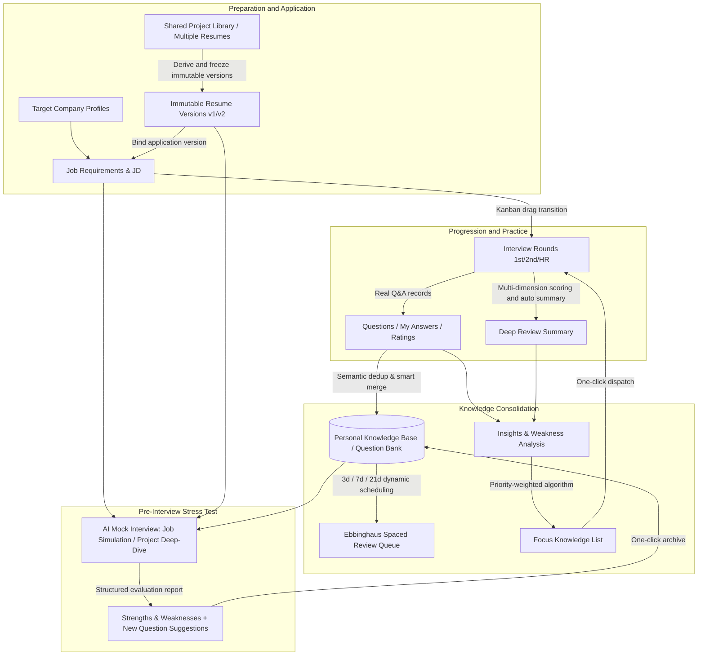
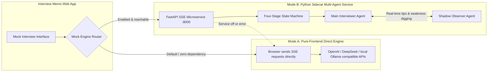

# 💼 Interview Memo

<div align="center">

**A Modern, Local-First Workbench for the Entire Job-Hunt & Interview Process**

Fine-grained application tracking · Build a high-frequency question bank · Ebbinghaus spaced repetition · Dual-engine multi-round mock interviews · Stealth anti-peek mode

[简体中文](./README.md) | **English**

[](https://react.dev/)
[](https://www.typescriptlang.org/)
[](https://vitejs.dev/)
[](https://tailwindcss.com/)
[](https://github.com/pmndrs/zustand)
[](https://vitest.dev/)
[](services/mock-agent-service)
[]()
[](LICENSE)

[Features](#-core-feature-highlights) • [Quick Start](#-quick-start) • [Dual Engines](#-dual-engine-mock-interview-architecture) • [The Loop](#-the-end-to-end-job-hunt-loop) • [Shortcuts](#%EF%B8%8F-keyboard-shortcuts) • [Tech Stack](#%EF%B8%8F-tech-stack)

</div>

---

## 🌟 Why Interview Memo?

During a competitive job-hunting season, candidates often apply to dozens or even hundreds of companies. Yet generic note-taking apps and spreadsheets come with many pain points:

- ❌ **Application version chaos**: You maintain multiple resumes for different technical tracks, and after applying it is easy to lose track of which version went to which company, or which specific projects were included.
- ❌ **Interviews are forgotten as soon as they end**: Technical details you stumbled on and weak spots end up scattered across notes — no deduplication, no consolidation, no systematic review.
- ❌ **Unscientific revision**: Flipping through interview write-ups by feel, with no forgetting-curve management, then tripping over the same topics again in the next round.
- ❌ **Practice without realism**: General-purpose LLMs lack the relentless follow-up questioning of a big-tech interviewer; they tend to wander in single-turn free-form chats and cannot recreate the pressure of a real interview.
- ❌ **Privacy leakage risk**: Uploading your salary expectations, job-hunt status, and full career history to third-party online collaboration platforms exposes you to data leaks.

**Interview Memo** is built to solve exactly these pain points:
- 🔒 **Purely local-first**: 100% of your data stays in your browser — no backend, no login, zero telemetry. Exported backups automatically strip API keys.
- 🔁 **A closed feedback loop**: A complete flywheel from "apply → track rounds → capture Q&A → deep review → Ebbinghaus revision → data insights → mock-interview stress tests".
- 🤖 **Dual-engine realistic simulation**: A zero-config pure-frontend direct streaming engine, plus an optional Python sidecar microservice with a stage state machine and a shadow observer agent.
- 🛡️ **Unique stealth anti-peek mode**: Press `Alt + P` to instantly mask every job-hunting keyword across the app and disguise the browser tab as `Dev Memo` — job hunting at the office, stress-free.

---

## 🔄 The End-to-End Job-Hunt Loop

In Interview Memo, data is not a pile of isolated cards — it is an interlocking flywheel:



---

## 🤖 Dual-Engine Mock Interview Architecture

To serve both "works out of the box, nothing to install" and "big-tech depth pressure interviews", the system uses a gracefully degrading dual-engine architecture:



### Engine Comparison

| Dimension | Built-in Engine (default) | External Python Sidecar Service (optional) |
| :--- | :--- | :--- |
| **Setup cost** | ⭐️ Zero dependencies — a browser is all you need | Requires running a local Python 3.10+ microservice (see `services/mock-agent-service`) |
| **Communication** | Frontend connects directly to any OpenAI-compatible LLM API | High-performance streaming over standard HTTP Server-Sent Events (SSE) |
| **Interview progression** | High-quality prompt-driven single-turn progression with streaming | **Stage state machine**: `Icebreaking` → `STAR project breakdown` → `fundamentals & high-concurrency stress` → `candidate questions` |
| **Decision making** | Basic contextual conversation | **Dual-agent collaboration**: a shadow observer analyzes technical gaps in the background and feeds follow-up suggestions to the main interviewer |
| **Failover** | Basic fallback mode | **Seamless graceful degradation**: when the sidecar is off or drops, the frontend automatically falls back to the built-in engine |

---

## ✨ Core Feature Highlights

### 1. 🛡️ Stealth Anti-Peeking Mode (Privacy Mode, `Alt + P`)
- **No awkward moments at the office or in public**: one toggle instantly masks every sensitive job-hunting term across the app through low-level DOM node replacement.
  - `面试` (interview) → `MS`, `求职` (job hunting) → `QZ`, `简历` (resume) → `JL`, `岗位` (position) → `GW`, `投递` (application) → `TD`, `薪资` (salary) → `XZ`, `Offer` → `OF`, `笔试` (written test) → `BS`, `一面/二面` (round 1/2) → `1M/2M`...
- **Tab disguise**: the browser title automatically changes to `Dev Memo`, so a colleague walking by or a screen-share session stays embarrassment-free.
- **Lossless toggle**: press the shortcut again to instantly restore the original text — the underlying stored data is never affected.

### 2. 📋 Full-Lifecycle Job Kanban (Kanban & Table Views)
- **Multi-stage flow**: Applied → Written Test → Round 1 → Round 2 → HR → Offer Received → Offer Accepted → Closed.
- **Drag & drop and bulk management**: smooth dragging powered by `@dnd-kit`, plus a powerful table view with multi-dimensional filtering and statistics.
- **Closure-reason tracking**: when a job is closed you can record why (failed interview, failed written test, declined offer, voluntary withdrawal) along with the stage at closure, keeping funnel conversion rates accurate and objective.
- **Resume binding**: every job can be linked to the exact resume version that was sent, carried through visibly in all subsequent interviews for that job.

### 3. 📄 Multi-Resume Management and Immutable Version Control
- **Multiple technical focuses**: maintain separate resumes independently (e.g. algorithms track, full-stack track, overseas English version).
- **Immutable version derivation**: "New version from this one" generates frozen `v1`, `v2`, `v3` versions. Versions referenced by jobs or mock sessions can only be archived, never physically deleted — historical application records stay truthful.
- **Shared project pool with snapshot freezing**: maintain one core project library; creating a resume version **deep-freezes** content snapshots of the currently selected projects. Later edits to the shared library never drift into historical application versions.
- **Local multi-format parser**: built-in PDF.js and Mammoth engines parse PDF, Word (`.docx`), Markdown, TXT, HTML, and RTF fully locally with zero dependencies, auto-extracting education, skills, and summary, with optional LLM-powered project-experience recognition.

### 4. 🎙️ Round-by-Round Interview Records and Structured Deep Review
- **Every round type covered**: rounds 1/2/3, HR, additional rounds, written tests; video, phone, and onsite formats.
- **Per-question review workbench**: record real interview questions, your answers, interviewer feedback, and ideal reference answers — and flag any question as a "weak spot" in one click.
- **Four-dimension scoring and smart summary**: rate overall performance, difficulty, technical fit, and role fit; if left untouched, the system auto-generates a review summary from your scores and weak spots.
- **Action-item checklist**: capture the learning tasks this interview exposed, check them off as you go, and carry them seamlessly into the next interview.

### 5. 🧠 Personal Question Bank and Ebbinghaus Spaced Repetition
- **Dual-pass dedup archiving**:
  - Fast local text-similarity pre-filtering;
  - Optional LLM semantic dedup (recognizing the same knowledge point asked in different forms), automatically accumulating frequency and recording aliases.
- **Ebbinghaus memory model**: questions carry three mastery levels — Proficient / Fair / Shaky. The list offers quick "Remembered / Fuzzy / Forgot" check-ins that automatically reschedule reviews at 21, 7, and 3 days respectively.
- **Structured taxonomy**: ships with an LLM-focused preset taxonomy (Transformer, SFT, RL, Agent, RAG); freely add or remove levels.

### 6. 📊 Multi-Dimensional Insights and a Smart Learning-Priority Algorithm
- **Hiring funnel**: stage-by-stage retention and pass rates computed by backtracking real transitions.
- **Weak-spot and high-frequency matrix**: compare tag frequency against weak-spot rates to spot the biggest gap in your preparation at a glance.
- **Scientific learning-priority algorithm**:
  $$\text{Priority Score} = \text{WeakRate} \times 0.4 + (5 - \text{AvgRating}) \times 0.3 + \text{AppearPenalty}$$
  The system computes a focus leaderboard automatically and supports **one-click push of top knowledge points into the next interview's study list**.
- **AI study advice**: call an LLM to generate a targeted sprint study plan from your full set of weak spots.

### 7. 🔍 Global Command Palette (`Ctrl/Cmd + K`)
- Press `Ctrl + K` (`Cmd + K` on Mac) anywhere in the app to summon the Command Palette instantly.
- Millisecond-level global fuzzy indexing across companies, jobs, interview records, knowledge points, mock sessions, and resumes, with arrow-key navigation straight to the target.

### 8. ⏰ Smart Alerts, Timed Reminders, and Strict Privacy
- **24-hour urgent alert**: the dashboard dynamically highlights upcoming interviews based on the current time; interviews within 24 hours get a high-saturation warning color and dynamic greetings.
- **Multi-level reminders**: configurable lead times of 1 day, 3 hours, 1 hour, 15 minutes, and more, delivered via in-app toasts and browser system notifications.
- **Strict Zod import validation**: full-overwrite or ID-based incremental merge, with precise error location hints on validation mismatch.
- **Credential stripping**: exported JSON automatically removes API keys and other secrets before serialization, making multi-device sync and migration safe.
- **Local storage monitoring**: real-time `localStorage` usage calculation, with one-click cleanup of expired mock conversations.

---

## ⌨️ Keyboard Shortcuts

| Shortcut | Action | When to use |
| :--- | :--- | :--- |
| <kbd>Ctrl + K</kbd> / <kbd>Cmd + K</kbd> | Open the global command palette | Quickly locate companies, jobs, interviews, or knowledge points across modules |
| <kbd>Alt + P</kbd> | Toggle stealth anti-peek mode | Quickly mask sensitive terms at the office, library, or in public |
| <kbd>Esc</kbd> | Close the current dialog / exit the search box | Any modal or drawer component |

---

## 🚀 Quick Start

### Prerequisites
- **Frontend app**: Node.js 18.0 or higher (pnpm / npm recommended)
- **External multi-agent mock service (optional)**: Python 3.10 or higher

---

### Step 1: Start the Frontend App

```bash
# 1. Clone the repository
git clone https://github.com/your-username/Interview-Memo.git
cd Interview-Memo

# 2. Install dependencies
npm install
# or with pnpm
# pnpm install

# 3. Start the local dev server
npm run dev
```

Open the local address printed in the terminal (usually `http://localhost:5173`). A demo dataset is preloaded on first launch so you can explore quickly.

#### Other common frontend commands

```bash
npm run build     # Production build
npm run preview   # Preview the production build
npm run lint      # Run Oxlint static code-quality checks
npm test          # Run the Vitest unit test suite (9 test files, all green)
```

---

### Step 2 (optional): Start the External Python Mock-Interview Sidecar Service

To experience multi-stage state-machine progression and dual-agent pressure testing in "Mock Interview", start the local Python microservice:

```bash
# 1. Enter the microservice directory
cd services/mock-agent-service

# 2. Create and activate a Python virtual environment
python -m venv .venv

# Windows:
.venv\Scripts\activate
# macOS / Linux:
source .venv/bin/activate

# 3. Install dependencies
pip install -r requirements.txt

# 4. (Optional) Configure an LLM API key — without one, the service runs a built-in offline state-machine demo
# Copy or create a .env file with:
# OPENAI_API_KEY=sk-xxxxxx
# OPENAI_BASE_URL=https://api.deepseek.com/v1
# OPENAI_MODEL=deepseek-chat

# 5. Start the microservice
uvicorn main:app --reload --host 127.0.0.1 --port 8000
```

#### Enable the sidecar in the frontend:
1. Open the app and go to **Settings** (`/settings`);
2. Find the **External Mock Interview Service (Sidecar)** card, check it to enable, and confirm the service address is `http://127.0.0.1:8000`;
3. Click **Test Connection** — a green "Online" badge means it is working;
4. Go to "Mock Interview" and start a session; a dedicated `⚡ External multi-agent driven` badge appears at the top.

---

## 📖 Page Map

```
/                     Dashboard (KPI stats, funnel analysis, upcoming interviews, review list)
├── /jobs             Job kanban & table (drag between stages, filter by company/priority)
│   └── /jobs/:id     Job detail (JD view, applied resume version, linked interview timeline)
├── /resumes          Resumes & projects (maintain multiple resumes, shared project library)
│   └── /resumes/:id  Resume detail (immutable version list, snapshot comparison, frozen project preview)
├── /interviews       Interview list (filter by timeline, company, round, status)
│   └── /interviews/:id Interview workbench (per-question records, weak-spot flags, one-click archive to the question bank)
├── /review           Review list (pending vs. reviewed interview stats)
│   └── /interviews/:id/review Deep review (four-dimension scoring, went-well / to-improve, auto-generated summary)
├── /calendar         Interview calendar (month/week/day views, urgency markers, first-day-of-week toggle)
├── /knowledge        Question bank (mastery filters, Ebbinghaus review queue, check-in updates)
├── /insights         Insights (hiring funnel, high-frequency topics, weak-spot matrix, learning-priority suggestions)
├── /companies        Company profiles (industry, tech direction, notes, associated jobs)
├── /mock             Mock interview lobby (resume parsing, project selection, mode configuration)
│   └── /mock/:id     Mock interview room (multi-round streaming Q&A, multi-agent follow-ups, structured feedback report)
└── /settings         Settings (preferences, stealth mode, reminder rules, LLM config, sidecar, data import/export)
```

---

## 🛠️ Tech Stack

### Frontend Architecture
- **Core framework**: [React 19](https://react.dev/) + [TypeScript](https://www.typescriptlang.org/) + [Vite 8](https://vitejs.dev/)
- **Routing**: [React Router 7](https://reactrouter.com/)
- **State & persistence**: [Zustand 5](https://github.com/pmndrs/zustand) (persistence middleware with cascading-delete safeguards)
- **Data schema & validation**: [Zod 4](https://zod.dev/) (strict import/export schema checks)
- **Styling & design system**: [Tailwind CSS v4](https://tailwindcss.com/) + [Radix UI](https://www.radix-ui.com/) + [Lucide React](https://lucide.dev/)
- **Interaction & visualization**:
  - [@dnd-kit](https://dndkit.com/): professional kanban drag & drop
  - [cmdk](https://cmdk.paco.me/): Raycast-style high-performance global command palette
  - [Recharts 3](https://recharts.org/): funnels, trends, and weak-spot distribution charts
  - [Sonner](https://sonner.emilkowal.ski/): modern toast notifications
- **Client-side document parsing**: [PDF.js](https://mozilla.github.io/pdf.js/) + [Mammoth.js](https://github.com/mwilliamson/mammoth.js)
- **Quality assurance**: [Vitest 3](https://vitest.dev/) (unit tests) + [Oxlint](https://oxc.rs/) (blazing-fast linting)

### External Microservice (Sidecar Service)
- **Service framework**: [Python 3.10+](https://www.python.org/) + [FastAPI](https://fastapi.tiangolo.com/) + [Uvicorn](https://www.uvicorn.org/)
- **AI & streaming**: HTTP Server-Sent Events (SSE) + OpenAI Python SDK
- **Multi-agent state machine**: staged progression through icebreaking, STAR project peeling, and high-concurrency fundamentals stress tests, plus a shadow observer for dynamic evaluation

---

## 🔒 Data & Privacy Notes

1. **100% data ownership**: all resume content, application records, interview Q&A, and reviews live only in your browser's `localStorage` — nothing is ever uploaded to a private server.
2. **API key isolation**: configured LLM API keys are stored locally only; when you run "Export data", the system strips API keys before serialization, so sharing JSON never leaks secrets.
3. **Fully offline capable**: all core management features (kanban, calendar, review, question bank, statistics, etc.) run smoothly with no network at all.
4. **Trusted LLM calls only**: context is sent to your self-configured LLM base URL only when you explicitly trigger dedup judgment / study advice / mock interviews.

---

## 📂 Directory Structure

```
Interview-Memo/
├── public/                 # Static assets
├── services/
│   └── mock-agent-service/ # External multi-agent mock-interview Python sidecar service
│       ├── agent.py        # State-machine progression and multi-agent core logic
│       ├── main.py         # FastAPI SSE interface and routes
│       └── README.md       # Standalone service startup guide
├── src/
│   ├── assets/             # Asset files
│   ├── components/         # Modular UI components
│   │   ├── common/         # Search box, stat cards, confirm dialogs, status badges, stealth-mode Provider
│   │   ├── interviews/     # Interview forms, question-entry dialogs
│   │   ├── jobs/           # Job forms, detail components
│   │   ├── layout/         # Sidebar, top navigation, page container
│   │   ├── mock/           # Mock interview configuration, project forms
│   │   ├── resumes/        # Resume version forms, snapshot views
│   │   └── ui/             # Radix UI primitives
│   ├── data/               # Demo seed data
│   ├── hooks/              # Custom React hooks
│   ├── lib/                # Pure functions and core business modules
│   │   ├── llm.ts          # LLM request wrapper and stream parsing
│   │   ├── mockEngine.ts   # Dual mock-engine adapter and SSE listener
│   │   ├── privacy.ts      # Stealth-mode MutationObserver masking manager
│   │   ├── resumeParse.ts  # PDF / Word / Markdown local parser and extractor
│   │   └── similarity.ts   # Question text-similarity algorithm
│   ├── pages/              # Route pages
│   ├── store/              # Zustand state management
│   │   ├── analytics.ts    # Funnel and priority-weighting statistics
│   │   ├── cascades.ts     # Cascading-delete safety mechanism
│   │   ├── io.ts           # Zod validation, JSON import/export
│   │   ├── knowledgeActions.ts # Question-bank archiving and Ebbinghaus flow
│   │   └── useAppStore.ts  # Global core store
│   └── types/              # Global TypeScript type definitions
├── vitest.config.ts        # Vitest test configuration
└── vite.config.ts          # Vite build configuration
```

---

## 📄 License

This project is released under the [MIT License](LICENSE).
